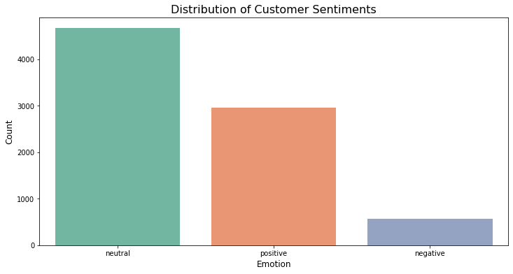

# Deciphering the Public Opinion on Apple
## Conducting a Twitter Sentiment Analysis for the SXSW Conference

### Introduction, Problem Statement, and Business Understanding
As digital brand advisors, we have been hired by Apple to conduct an analysis that assesses public opinion about the company based on a Twitter sentiment analysis from the South by Southwest (SXSW) conference, which celebrates the convergence of tech and societal factors like education and culture.

Companies can leverage social media platforms like Twitter to identify public opinion about their products and activities. Twitter is a rich source of data, with people sharing varied opinions about businesses, making it an ideal platform for sentiment analysis.

For this project, Apple has tasked us with conducting a sentiment analysis of tweets presented during the SXSW Conference. The objectives of our analysis are:

### Objectives
1. Determine how Apple is perceived as a company during the SXSW Conference, compared to its main competitor, Google.
2. Understand consumers' reactions to Apple’s SXSW announcements, particularly how new products are perceived.
3. Seek insights into challenges Apple faces during product announcements.
4. Develop a model that can classify the sentiment of tweets (positive, negative, or neutral), enabling Apple to assess public opinion and stay ahead of the competition.

### Data Understanding
The dataset for this analysis was sourced from data.world, provided by CrowdFlower. It contains tweets about Google and Apple from a conference. The tweets were labeled based on the emotion conveyed and the target product or brand.

#### Data Limitations
- Twitter data contains misspellings, hashtags, and shortened words, making it difficult for a model to learn.
- Emotions are complex, and tweets can express a mix of emotions or ambiguity.
- The dataset is highly imbalanced in terms of target values (emotions), which requires careful handling during modeling.
## Data Cleaning
- We handled missing values by replacing null values in the `Product/Brand` column with "Unknown."
- Cleaned the `Emotion` column by mapping values like 'Positive emotion' to 'Positive,' and similarly for other values.

## Exploratory Data Analysis (EDA)

- We analyzed the most frequent words in positive and negative tweets, removing stop words and irrelevant tokens.
- Word clouds were generated for visualizing common terms in positive and negative sentiments.

## Modeling

### Baseline Model - Logistic Regression
- A logistic regression model was built using a pipeline with a `CountVectorizer`. The model achieved an accuracy score of 68% on the test set.

### TF-IDF Vectorizer and Resampling
- We improved the baseline by switching to `TfidfVectorizer` and addressing class imbalance using `RandomOverSampler`. This improved generalization, but the model still misclassified some negative sentiments as positive.

### Model Tuning
- We fine-tuned several models (Logistic Regression, Naive Bayes, Decision Tree, etc.) using grid search. The best-performing model was a Gradient Boosting model with a test accuracy of 61%.

## Results and Recommendation
- Both Apple and Google received more positive than negative tweets during the SXSW conference (Apple: 81.1% positive, Google: 82% positive).
- The final Gradient Boosting model achieved a 62% accuracy, with a good balance between precision and recall for positive and negative sentiments.

## Further Research
- The data could be updated with more recent tweets, and more advanced models such as transformers should be explored to improve performance further.

